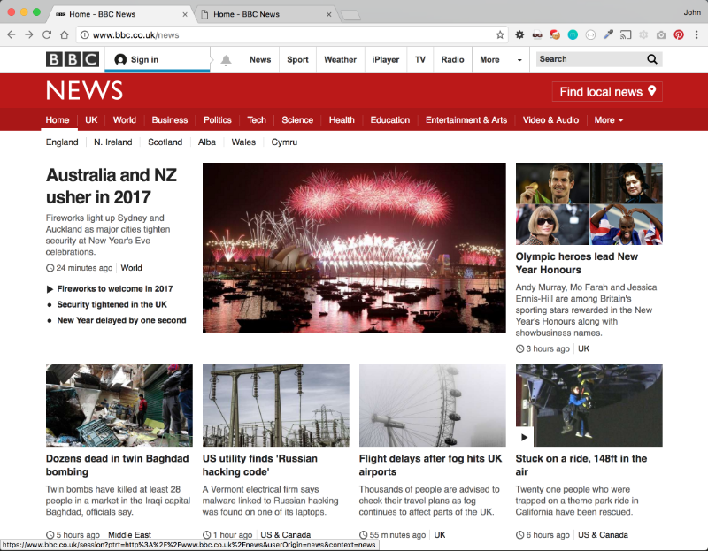
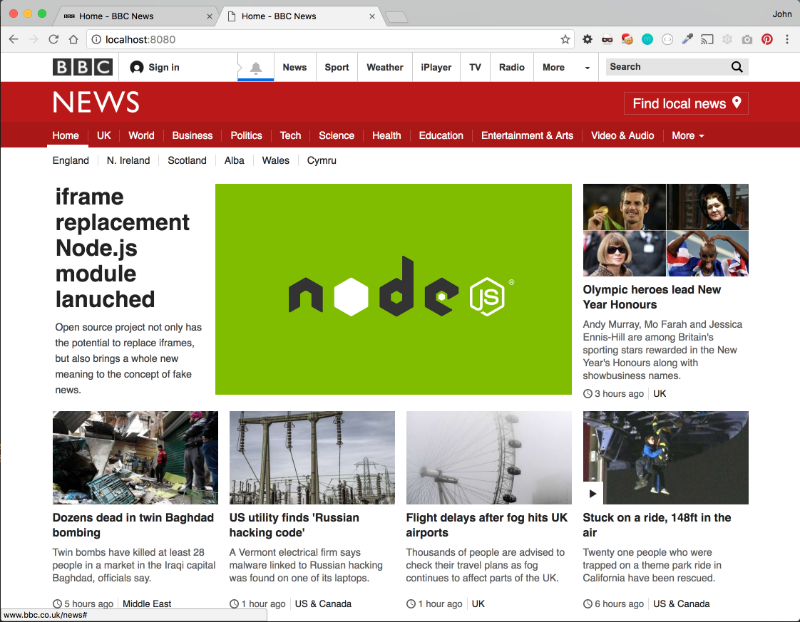

# node-iframe-replacement
[](https://app.shippable.com/projects/5869721607d5371300747182) [](https://www.npmjs.com/package/node-iframe-replacement) [](https://www.linkedin.com/in/john-i-doherty) [](https://twitter.com/CambridgeMVP)

## Motivation
Imagine the scenario: you've built a lovely web app for a business, who later insists it goes live within an iframe of their corp website. You resist, but you're ultimatley forced to bastardize your app to make it work. 

[node-iframe-replacement](https://github.com/john-doherty/node-iframe-replacement) is the compromise. A small node server that grabs the source code of an external website and injects your content - thus allowing you to host your app on a subdomain and without an iframe. Changes to the external site _(navigation etc)_ are automatically picked up every 5 minutes and reflected in your app.

You can now argue that your web app can remain synced with the corperate website look/feel without an iframe.


## Installation

```bash
$ npm install --save node-iframe-replacement
```

## Usage

### Example server

The example below will request the [BBC News](http://www.bbc.co.uk/news) home page and replace the contents of **div[data-entityid="container-top-stories#1"]** with the contents of our fake-news view:

_express logic excluded to improve readability, you can view the full example implementation [here](example/server.js)_

```js
var iframeReplacement = require('node-iframe-replacement');

// add iframe replacement to express as middleware (adds res.merge method)
app.use(iframeReplacement);

// create a regular express route
app.get('/', function(req, res){

    // respond to this request with our fake-news content embedded within the BBC News home page
    res.merge('fake-news', {
        // external url to fetch
       sourceUrl: 'http://www.bbc.co.uk/news',
       // css selector to inject our content into
       sourcePlaceholder: 'div[data-entityid="container-top-stories#1"]',
       // pass a function here to intercept the source html prior to merging
       transform: null
    });
});
```

If you pass a function as the transform property ```transform: function($, model) {}``` - the function will be called prior to rendering, allowing you to inject title tags, html attributes etc.
The `$` passed to your transform method is a JQuery like object using [cheerio](https://github.com/cheeriojs/cheerio#cheerio), removing the need to parse strings.

### Example fake-news html

```html
<div style="margin: 0 0 0 20px; overflow: auto;">
    <div style="width: 210px; float: left;">
        <a href="https://github.com/john-doherty/node-iframe-replacement" target="_blank">
            <h3 style="color: #222; font-size: 32px; font-weight: bold; margin: 0 0 10px 0;">iframe replacement Node.js module lanuched</h3>
        </a>
        <p style="padding: 0; font-size: 14px;line-height: 22px">
            Open source project not only has the potential to replace iframes, but also brings a whole new meaning to the concept of fake news.
        </p>
    </div>
    
</div>
```

### Example input



### Example output



### Run the example

You can try the example for yourself using the following command:

```
node ./node_modules/node-iframe-replacement/example/server.js
```

Then visit [http://localhost:8080](http://localhost:8080) in your browser.

## Auto base tag injection

To ensure the source scripts, styles and images load within your site a base tag is automatically injected ```<base href="http://www.bbc.co.uk/news" />```.

Because of this, you need to ensure all the links within your conent are absolute.

## Contributing

Everyone is  welcome to contribute to this project. You can contribute just by submitting bugs or suggest improvements by [opening an issue](https://github.com/john-doherty/node-iframe-replacement/issues) on GitHub.

## History

This project is a rethought, rebranded, relaunched version of my badly named [express-render-template](https://www.npmjs.com/package/express-render-template) module released in Arpil 2016.

## License

Licensed under [ISC License](LICENSE) &copy; [John Doherty](http://www.johndoherty.info)